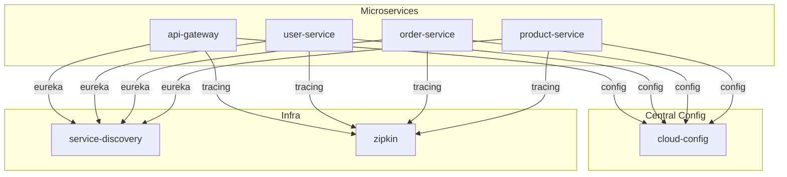

# Patrones de Configuración en la Infraestructura de Microservicios

Este documento describe los **patrones de configuración** implementados en el despliegue de los microservicios de ecommerce sobre Kubernetes y Azure.

---

## 1. Configuración Centralizada (Centralized Configuration)

### ¿Qué es?
Consiste en tener un **servidor central de configuración** (Spring Cloud Config Server) que almacena y expone la configuración de todos los microservicios. Así, los servicios no dependen de archivos locales ni variables de entorno para su configuración principal, sino que la obtienen dinámicamente desde un punto central.

### ¿Dónde se ve?
- El microservicio `cloud-config` ([k8s/cloud-config/deployment.yaml](k8s/cloud-config/deployment.yaml)) es el servidor central de configuración.
- Todos los microservicios (`api-gateway`, `user-service`, `order-service`, `product-service`, etc.) tienen la variable de entorno:
  ```yaml
  - name: SPRING_CLOUD_CONFIG_URI
    value: "http://cloud-config:9296"
  ```
  Esto indica que deben obtener su configuración desde el servidor central.

### Ventajas
- **Un solo lugar para gestionar la configuración** de todos los servicios.
- **Cambios dinámicos**: puedes actualizar la configuración sin redeplegar los servicios.
- **Consistencia**: todos los servicios usan la misma fuente de verdad.

---

## 2. Configuración por Entorno (Environment-based Configuration)

### ¿Qué es?
Permite que los servicios se comporten diferente según el entorno (dev, stage, prod) usando perfiles de configuración.

### ¿Dónde se ve?
- Cada microservicio define el perfil activo con:
  ```yaml
  - name: SPRING_PROFILES_ACTIVE
    value: "dev"
  ```
- El servidor de configuración puede servir archivos distintos según el perfil (`application-dev.yml`, `application-prod.yml`, etc.).

### Ventajas
- **Separación de ambientes**: puedes tener configuraciones distintas para desarrollo, pruebas y producción.
- **Facilita pruebas y despliegues seguros**.

---

## 3. Configuración de Descubrimiento de Servicios (Service Discovery Configuration)

### ¿Qué es?
Los microservicios no conocen las direcciones de los demás servicios de antemano, sino que usan un **servidor de descubrimiento** (Eureka) para encontrarse dinámicamente.

### ¿Dónde se ve?
- Variable de entorno en los servicios:
  ```yaml
  - name: EUREKA_CLIENT_SERVICEURL_DEFAULTZONE
    value: "http://service-discovery:8761/eureka/"
  ```
- El servicio `service-discovery` ([k8s/service-discovery/deployment.yaml](k8s/service-discovery/deployment.yaml)) es el servidor Eureka.

### Ventajas
- **Escalabilidad**: los servicios pueden escalar sin necesidad de reconfigurar endpoints.
- **Resiliencia**: los servicios pueden descubrir instancias nuevas automáticamente.

---

## 4. Configuración de Trazabilidad Distribuida (Distributed Tracing Configuration)

### ¿Qué es?
Permite que los microservicios reporten trazas a un sistema central (Zipkin) para monitoreo y debugging.

### ¿Dónde se ve?
- Variable de entorno en los servicios:
  ```yaml
  - name: SPRING_ZIPKIN_BASE_URL
    value: "http://zipkin:9411"
  ```
- El servicio `zipkin` ([k8s/zipkin/deployment.yaml](k8s/zipkin/deployment.yaml)) es el recolector de trazas.

### Ventajas
- **Observabilidad**: puedes rastrear peticiones entre servicios.
- **Debugging**: facilita encontrar cuellos de botella y errores.

---

## 5. Configuración Declarativa y Versionada

### ¿Qué es?
Toda la configuración de infraestructura y despliegue está **declarada como código** (IaC) y versionada en el repositorio.

### ¿Dónde se ve?
- Archivos de Terraform en [`terraform/`](terraform/)
- Manifiestos de Kubernetes en [`k8s/`](k8s/)

### Ventajas
- **Reproducibilidad**: puedes recrear entornos fácilmente.
- **Auditoría**: todos los cambios quedan registrados en el control de versiones.

---

## Resumen Visual



---

## Referencias

- [Spring Cloud Config](https://cloud.spring.io/spring-cloud-config/reference/html/)
- [Spring Cloud Netflix Eureka](https://cloud.spring.io/spring-cloud-netflix/reference/html/)
- [Zipkin](https://zipkin.io/)
- [Infrastructure as Code (IaC)](https://learn.microsoft.com/en-us/devops/deliver/what-is-infrastructure-as-code)

---
